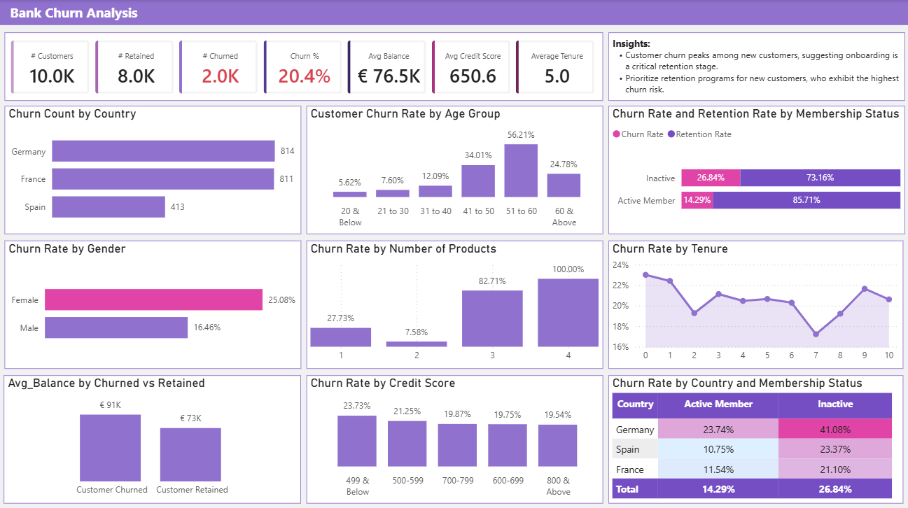
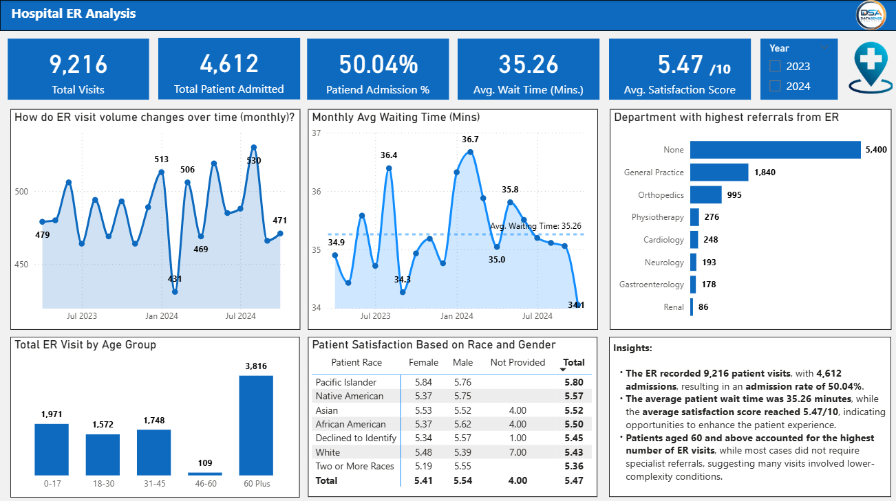
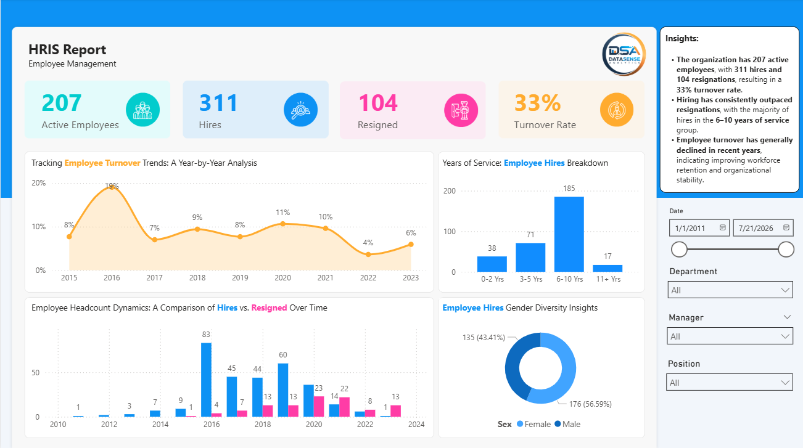
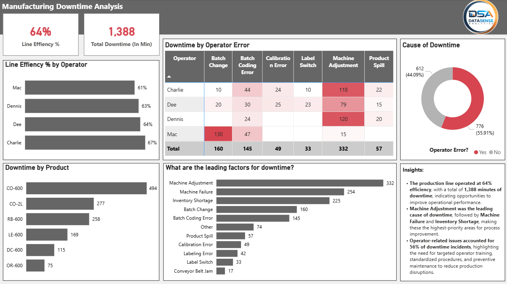
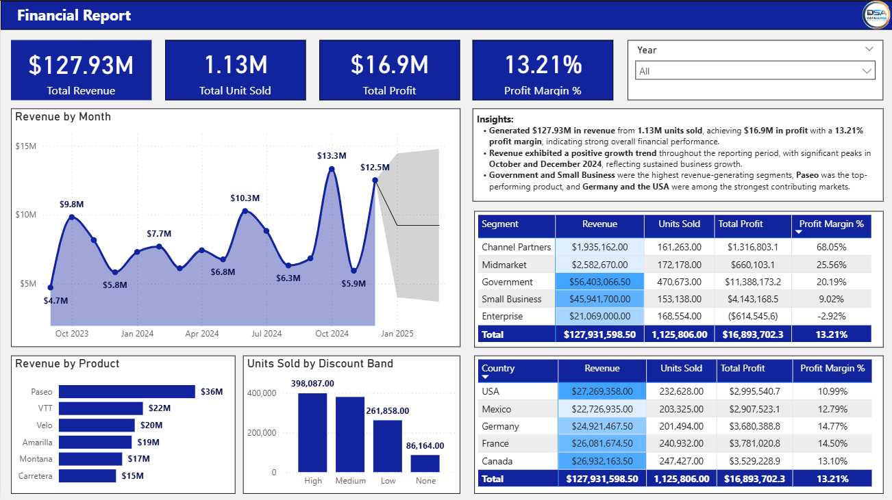

# ☕ S.O.M.S.

## Brewing Insights. Delivering Impact.

### Business Intelligence & Data Analytics Professional

I transform raw data into actionable business insights through analytics, dashboard development, and data storytelling.

---

# 👋 About Me

Hi! I'm **Somel Chan**, a Business Intelligence & Data Analytics Professional passionate about transforming complex datasets into meaningful business decisions.

My portfolio demonstrates complete analytics projects—from business understanding and data preparation to dashboard development and actionable recommendations.

---

# 🏆 Featured Analytics Case Studies

## 🏦 Bank Churn Analysis

Customer Retention Analytics

---

## 🏠 Airbnb Executive Dashboard

Hospitality Performance Analytics

---

## 🏥 Hospital ER Analysis

Healthcare Operations Analytics

---

## 👥 HR Data Analytics

Human Resource Analytics

---

## 🏭 Manufacturing Downtime Analysis

Manufacturing Performance Analytics

---

## 🍽 Food & Beverage Sales Dashboard

Retail Sales Analytics

---

## 💰 Financial Report Dashboard

Financial Performance Analytics

---

## 📞 Financial Consumer Complaints

Customer Experience Analytics

---

## 🌍 Global CO₂ Emissions *(Coming Soon)*

---

# 🛠 Technical Skills

### Business Intelligence

- Power BI
- Power Query
- DAX

### Data Analytics

- SQL
- Excel
- Python *(Learning)*

### Analytics

- Dashboard Design
- KPI Development
- Data Cleaning
- Data Modeling
- Business Analysis
- Data Storytelling
- Process Improvement
- Lean Six Sigma

---

# 📬 Let's Connect

📧 Email: your@email.com

💼 LinkedIn:
https://linkedin.com/in/yourprofile

---

> **S.O.M.S.**
>
> Brewing Insights. Delivering Impact.