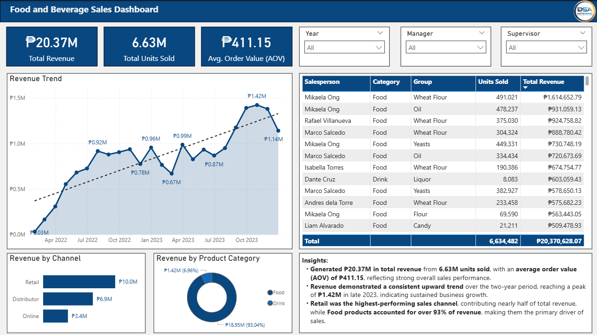
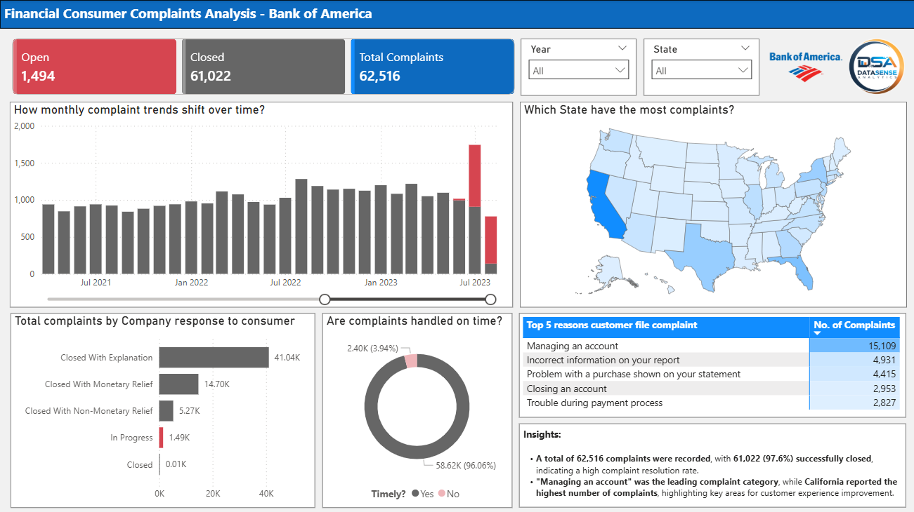

# ☕ S.O.M.S.

## Brewing Insights. Delivering Impact.

### Business Intelligence • Data Analytics • Data Storytelling

Welcome to my Data Analytics Portfolio.

I transform raw data into actionable business insights through interactive dashboards, business intelligence, and data storytelling.

---

# 👋 About Me

Hi! I'm **Somel Chan**.

I specialize in transforming complex datasets into meaningful business decisions using Power BI, SQL, Excel, and Python.

My portfolio demonstrates complete analytics projects—from business understanding and data preparation to dashboard development, KPI design, and executive-level recommendations.

---

# 🚀 Featured Analytics Case Studies

---

## 🏦 Bank Churn Analysis

### Customer Retention Analytics

Identify customer churn drivers and recommend retention strategies through customer segmentation and behavioral analysis.

➡️ **[View Complete Case Study](case-studies/bank-churn-analysis)**

---

## 🏠 Airbnb Executive Dashboard

### Hospitality Performance Analytics

Analyze listing performance, pricing trends, occupancy patterns, and market opportunities.

➡️ **[View Complete Case Study](case-studies/airbnb-executive-dashboard)**

---

## 🏥 Hospital ER Analysis

### Emergency Department Performance

Evaluate patient flow, waiting time, referrals, and operational efficiency.

➡️ **[View Complete Case Study](case-studies/hospital-er-analysis)**

---

## 👥 HR Data Analytics

### Workforce Analytics

Analyze employee demographics, attrition, workforce distribution, and HR performance metrics.

➡️ **[View Complete Case Study](case-studies/hr-data-analytics)**

---

## 🏭 Manufacturing Downtime Analysis

### Production Performance Analytics

Identify downtime drivers, production losses, and operational improvement opportunities.

➡️ **[View Complete Case Study](case-studies/manufacturing-downtime-analysis)**

---

## 🍽 Food and Beverage Sales Dashboard

### Sales Performance Analytics

Analyze revenue trends, product performance, customer purchasing behavior, and profitability.

➡️ **[View Complete Case Study](case-studies/food-and-beverage-sales-dashboard)**

---

## 💰 Financial Report Dashboard

### Executive Financial Reporting

Monitor financial performance using executive KPIs, profitability metrics, and business trends.

➡️ **[View Complete Case Study](case-studies/financial-report)**

---

## 📞 Financial Consumer Complaints Analysis Bank Of America

### Customer Experience Analytics

Analyze complaint trends, issue categories, customer satisfaction, and service quality.

➡️ **[View Complete Case Study](case-studies/financial-consumer-complaints)**

---

## 🌍 Global CO₂ Emissions Analysis *(Coming Soon)*

An executive sustainability dashboard focused on emissions trends, regional comparisons, and environmental insights.

---

# 🛠 Technical Skills

### Business Intelligence

- Power BI
- Power Query
- DAX

### Data Analytics

- SQL
- Excel
- Python *(Currently Learning)*

### Data Visualization

- Dashboard Design
- KPI Development
- Business Storytelling
- Executive Reporting

### Data Preparation

- Data Cleaning
- Data Modeling
- ETL
- Data Transformation

### Business

- Business Analysis
- Process Improvement
- Lean Six Sigma

---

# 📬 Let's Connect

📧 **Email**

**somelerano.chan@gmail.com**

💼 **LinkedIn**

**https://linkedin.com/in/somschan**

---

> ### ☕ S.O.M.S.
>
> **Brewing Insights. Delivering Impact.**
>
> Turning data into decisions—one dashboard at a time.