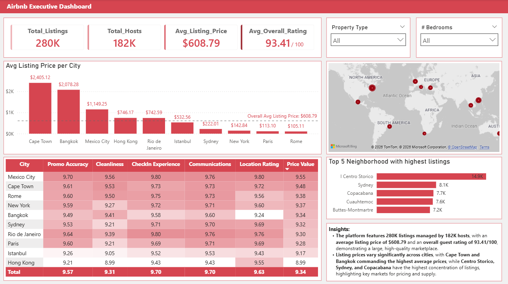

# 🏠 Airbnb Executive Dashboard

> **Executive Analytics Case Study**  
> **Industry:** Hospitality & Travel Analytics  
> **Tool:** Microsoft Power BI

---

# 1. Business Context

## Background

The Airbnb marketplace generates millions of listing records across cities worldwide. Hosts and property managers need timely insights into pricing, customer satisfaction, property availability, and neighborhood demand to remain competitive in an increasingly dynamic market.

Without an executive reporting solution, identifying market opportunities and pricing trends requires extensive manual analysis across multiple datasets.

This project was developed to transform raw Airbnb listing data into an interactive executive dashboard that supports strategic decision-making.

---

# 2. Business Challenge

Airbnb stakeholders require answers to several critical business questions:

- Which cities command the highest listing prices?
- Which neighborhoods have the highest market activity?
- How competitive is each market?
- Which locations provide the greatest revenue opportunities?
- How does customer satisfaction compare across cities?
- What factors should influence pricing strategies?

Without centralized reporting, these insights remain difficult to identify quickly and consistently.

---

# 3. Project Objectives

The objective of this project was to develop an executive-level Power BI dashboard capable of:

- Monitoring overall marketplace performance
- Comparing pricing across cities
- Identifying high-performing neighborhoods
- Evaluating customer satisfaction metrics
- Supporting pricing optimization
- Providing executives with actionable business insights

---

# 4. Dataset Overview

| Category | Details |
|------------|---------------------------|
| Industry | Hospitality |
| Visualization Tool | Microsoft Power BI |
| Data Preparation | Power Query |
| Calculations | DAX |
| Dataset | Airbnb Listings |
| Scope | Global Listings |

### Dataset Includes

- Listings
- Hosts
- Property Types
- Bedroom Counts
- Neighborhoods
- Geographic Locations
- Guest Ratings
- Pricing Information
- Availability Data

---

# 5. Analytics Approach

This project followed a complete Business Intelligence workflow.

## Data Preparation

- Cleaned and transformed raw Airbnb listing data
- Removed inconsistencies and standardized fields
- Prepared data for analytical reporting

## Data Modeling

Developed an optimized data model connecting:

- Listings
- Hosts
- Cities
- Neighborhoods
- Property Types

## KPI Development

Created executive KPIs including:

- Total Listings
- Total Hosts
- Average Listing Price
- Average Overall Rating

## Dashboard Design

Designed an executive dashboard focused on:

- Marketplace Performance
- Geographic Analysis
- Pricing Trends
- Customer Experience
- Market Opportunities

---

# 6. Dashboard Preview

## Executive Dashboard

### Dashboard Components

- Executive KPI Cards
- Average Listing Price by City
- Global Listing Distribution Map
- Customer Experience Heatmap
- Top Neighborhood Rankings
- Executive Insights Panel
- Interactive Filters

---

# 7. Key Performance Indicators (KPIs)

| KPI | Business Purpose |
|------|------------------|
| Total Listings | Measures marketplace size |
| Total Hosts | Indicates platform participation |
| Average Listing Price | Evaluates pricing competitiveness |
| Average Overall Rating | Measures customer satisfaction |
| Property Type Filter | Enables market segmentation |
| Bedroom Filter | Supports inventory analysis |

---

# 8. Executive Findings

## 📈 Finding 1 — Pricing varies significantly across cities.

Cape Town and Bangkok recorded the highest average listing prices, while several European cities maintained substantially lower average pricing.

### Business Impact

Pricing strategies should be localized rather than standardized across markets.

---

## 🌍 Finding 2 — Listing activity is concentrated within specific neighborhoods.

Centro Storico contains the highest number of Airbnb listings, followed by Sydney and Copacabana.

### Business Impact

High-density neighborhoods represent strong demand but also increased market competition.

---

## ⭐ Finding 3 — Customer satisfaction remains consistently strong.

Cities achieved review scores above 9.0 across cleanliness, communication, check-in experience, and location ratings.

### Business Impact

Strong customer satisfaction supports premium pricing and reinforces marketplace competitiveness.

---

## 💰 Finding 4 — Premium pricing is not solely driven by listing volume.

Several cities command significantly higher average prices despite having fewer listings.

### Business Impact

Market positioning and customer demand influence pricing beyond inventory size alone.

---

# 9. Business Recommendations

## Recommendation 1

Implement city-specific pricing strategies based on local market demand instead of applying a uniform pricing model.

**Expected Outcome**

- Improved pricing competitiveness
- Increased booking potential

---

## Recommendation 2

Prioritize investment and marketing efforts within high-performing neighborhoods where listing demand remains consistently strong.

**Expected Outcome**

- Higher occupancy rates
- Improved revenue opportunities

---

## Recommendation 3

Continue monitoring customer satisfaction metrics to maintain competitive advantage and support premium pricing strategies.

**Expected Outcome**

- Increased guest loyalty
- Stronger marketplace reputation

---

## Recommendation 4

Perform deeper analysis on premium-priced cities to identify the factors contributing to higher willingness to pay.

**Expected Outcome**

- Improved pricing optimization
- Better market positioning

---

# 10. Technical Highlights

## Business Intelligence

- Executive Dashboard Design
- KPI Development
- Interactive Reporting
- Business Storytelling

## Data Analytics

- Data Cleaning
- Data Transformation
- Data Modeling
- Exploratory Data Analysis
- Trend Analysis

## Power BI

- Power Query
- DAX Measures
- Interactive Visualizations
- Maps
- Heatmaps
- Dynamic Filters

---

# 11. Business Value Delivered

This dashboard enables decision-makers to:

- Monitor overall marketplace performance
- Compare pricing across global cities
- Identify high-value investment opportunities
- Evaluate customer satisfaction
- Analyze neighborhood competitiveness
- Support data-driven pricing decisions
- Improve executive reporting efficiency

---

# 12. Skills Demonstrated

### Analytics

- Business Intelligence
- Executive Reporting
- KPI Design
- Data Visualization
- Business Storytelling
- Trend Analysis

### Technical

- Microsoft Power BI
- DAX
- Power Query
- Data Modeling

### Business

- Strategic Analysis
- Decision Support
- Executive Dashboard Development

---

# 13. Tools Used

- Microsoft Power BI
- Power Query
- DAX
- Microsoft Excel

---

# 14. Project Outcome

The Airbnb Executive Dashboard demonstrates an end-to-end Business Intelligence solution that transforms raw marketplace data into actionable executive insights. By integrating data preparation, KPI development, interactive visualizations, and business storytelling, the dashboard enables stakeholders to evaluate pricing performance, identify investment opportunities, and support strategic decision-making through a centralized analytics platform.

---

## Author

**Somel Chan (S.O.M.S.)**

**Brewing Insights. Delivering Impact. ☕**
